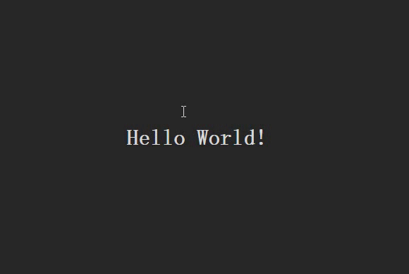

# firework
Basicly, this plugin provides a simple component for showing firework after clicked.
The effect of this plugin is showed as followed:

## Introduction
This plugin is built by ES6, and if necessary, I'll restructure this with ES5 or simply translate it to ES6 using Babel.

The plugin is working on a ``<canvas>`` tag. So HTML5 is required.  
And it uses *bezier curves* to improve the effect which makes the animation more naturally. 

## Usage
You can simply import the plugin by including the *firework.js* file, without other dependencies.

````

And it require user to built a canvas as the target of the plugin. After that, enable the plugin as followed:

``  firework({
    targetId: 'my_firework',
  })``

You can simply use the default setting, or custom it as your will. The setting includes 
``  width,
    height,
    range,
    duration,
    firePieceNumber,
    firePieceSize,
    easing,
    background,
    trigger,
    fullScreen``.
    
If you don't want the canvas covers the background image, you can just set the opacity of plugin background to ``rgba(255, 255, 255, 0)``.

Check *test.html* for a try.
